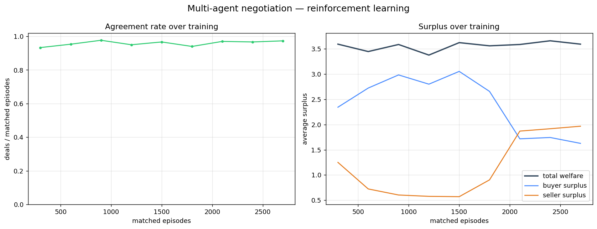

# rl-semantic-marketplace

Multi-agent negotiation where **buyer and seller agents** trade items described by
a **shared RDF/OWL ontology** (semantic matching via SPARQL) and **learn their
negotiation strategy by reinforcement learning** (Q-learning), exchanging
FIPA-ACL messages. The three pillars are integrated, not bolted together:

```
      ontology (RDF/OWL)                    reinforcement learning
   shared vocabulary + SPARQL                 (Q-learning)
   "does this item fit the buyer?"     "when to propose / accept what price?"
            │                                      │
            └───────────► multi-agent negotiation ◄┘
              buyer & seller exchange FIPA-ACL messages
              (CFP → PROPOSE → ACCEPT / REJECT) per episode
```

Everything runs **offline** on a lightweight asyncio agent runtime — no server,
deterministic, testable. A **SPADE adapter** maps the same agents onto real
networked XMPP agents for deployment.

---

## The three pillars

**Semantic web (rdflib).** Items and buyer preferences are RDF resources under a
small [ontology](ontology/marketplace.ttl) with a category taxonomy. A buyer who
wants a broad category is satisfied by an item of a narrower one, resolved by a
SPARQL `rdfs:subClassOf*` path, genuine ontological reasoning, not hard-coded
`if`s. This is the **gate**: only semantically-matching pairs negotiate.

```
Laptop is a: Category, Computer, Electronics, Laptop
laptop1 -> alice : MATCH  (wants Electronics, minQ 7 — Laptop⊂Electronics, q8≥7)
chair1  -> alice : no     (wants Electronics — Chair is Furniture)
laptop1 -> bob   : no     (wants Electronics but minQ 9 — q8<9)
```

**Multi-agent (FIPA-ACL runtime).** A `MessageBus` + `Agent` + `Behaviour` model
(the same concepts as SPADE/PADE) carries the negotiation: the buyer opens with a
`CFP`, the seller `PROPOSE`s a price, the buyer `ACCEPT`s or `REJECT`s, over up to
four rounds.

**Reinforcement learning (Q-learning).** Both agents learn from the surplus they
earn: the **seller** learns a *pricing/concession* policy (state = round), the
**buyer** an *acceptance* policy (state = round + proposed price). They co-adapt
over thousands of episodes.

---

## Result: learning works (`make simulate`)

Trained agents vs a random-policy baseline, on the same held-out scenarios
(learning disabled):

| Metric | Random | **Trained** |
|--------|:------:|:-----------:|
| agreement rate | 0.79 | **0.96** |
| total welfare | 3.02 | **3.52** |
| buyer surplus | 1.82 | 1.14 |
| seller surplus | 1.20 | 2.37 |

RL raises the **agreement rate** (0.79 → 0.96) and **total welfare** (3.02 →
3.52): the agents learn to reach efficient deals instead of walking away. The
**surplus split** shifts toward the seller, a genuine multi-agent dynamic: the
seller moves first on price and learns to capture more of the surplus, while the
buyer only learns to reject clearly-bad offers. It's an emergent equilibrium, not
a bug.



Roughly a third of sampled scenarios pass the semantic gate; the rest are
filtered out by the ontology before any negotiation.

---

## Multi-agent transport: offline runtime + SPADE

The negotiation logic and the learned policies are transport-independent:

- **Offline runtime (default).** An in-process asyncio bus, the whole system
  trains and runs anywhere, deterministically, with no XMPP server. This is what
  the simulation, tests and CI use.
- **SPADE deployment.** [`spade_adapter.py`](src/marketplace/spade_adapter.py)
  reimplements the same buyer/seller as real **SPADE** agents over XMPP. Set up a
  server with [`setup/prosody_localhost.sh`](setup/prosody_localhost.sh) and run
  [`scripts/run_spade.py`](scripts/run_spade.py). Only the message transport
  changes; the policy and protocol are identical.

> Why two? SPADE needs a running XMPP server (and TLS certs), which shouldn't be
> a prerequisite for training or CI. So the RL/semantics run everywhere, and
> SPADE is the networked deployment path, the same split you'd use in practice.

---

## Quickstart

```bash
pip install -r requirements.txt && pip install -e .

make ontology   # semantic matching demo (SPARQL taxonomy)
make simulate   # train agents, compare to random, plot learning curves
make test       # 13 tests
```

Deploy on real SPADE agents (optional):

```bash
sudo bash setup/prosody_localhost.sh      # local XMPP server + accounts
pip install -r requirements-spade.txt
python scripts/run_spade.py
```

---

## Layout

```
ontology/marketplace.ttl      RDF/OWL ontology (categories, items, buyers)
src/marketplace/
  ontology.py     load + SPARQL semantic matching (taxonomic reasoning)
  runtime.py      asyncio FIPA-style agent runtime (Agent, Behaviour, bus)
  messages.py     FIPA-ACL messages + performatives
  rl.py           tabular Q-learning
  agents.py       buyer & seller negotiation behaviours (ontology gate + RL)
  environment.py  scenario sampling + outcomes
  simulation.py   training loop, random-vs-trained evaluation, learning curve
  spade_adapter.py real SPADE agents (XMPP deployment)
  viz.py          learning-curve plots
scripts/          run_simulation · ontology_demo · run_spade
setup/            prosody_localhost.sh (XMPP server)
tests/            ontology, runtime, rl, simulation
docs/             ARCHITECTURE · RESULTS · IMPROVEMENTS
```

## Design notes
- **Ontology as the gate**: the semantic layer decides *who negotiates*, the RL
  decides *how*, a clean separation of the three concerns.
- **Memoised SPARQL**: the taxonomic check is computed by SPARQL and cached, so a
  long simulation stays fast without giving up real semantic reasoning.
- **Same policy, two transports**: identical negotiation on the offline bus and
  on SPADE/XMPP.

See [`docs/ARCHITECTURE.md`](docs/ARCHITECTURE.md),
[`docs/RESULTS.md`](docs/RESULTS.md), [`docs/IMPROVEMENTS.md`](docs/IMPROVEMENTS.md).

## Related project
This is the **competitive** side of multi-agent RL, a zero-sum-ish negotiation
between a buyer and a seller. Its counterpart,
[`semantic-rescue-coordination`](https://github.com/), tackles the **cooperative**
side: responder agents share one objective and form coalitions, coordinated with
the FIPA Contract-Net Protocol. Same three pillars (multi-agent + semantic web +
RL), opposite incentive structures.

## Tech stack
Python · rdflib (RDF/OWL + SPARQL) · asyncio · matplotlib. Deployment: **SPADE**
(agents over XMPP) via `spade_adapter.py` + `scripts/run_spade.py`, see
[`docs/RUNNING_SPADE.md`](docs/RUNNING_SPADE.md).

## License
MIT.
